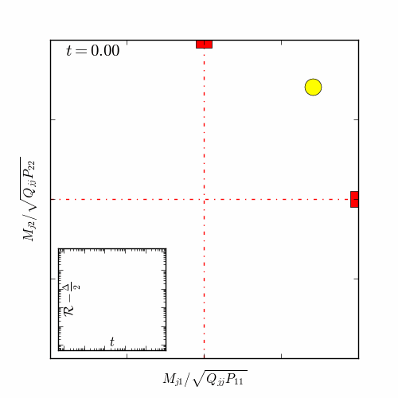
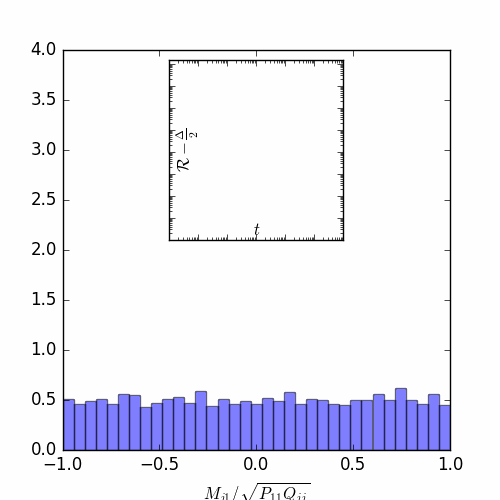

# A unifying approach to SGD in two-layers nets



<p><i>
 Left: evolution of student's weights overlapping with two neurons teacher, in classical regime. <br>
 Right: evolution of the student overlapping distribution if a single neuron teacher, in the mean-field regime.
</i><p>

<!-- ### Abstract
This manuscript investigates the one-pass stochastic gradient descent (SGD) dynamics of a two-layer neural network trained on Gaussian data and labels generated by a similar, though not necessarily identical, target function. We rigorously analyse the limiting dynamics via a deterministic and low-dimensional description in terms of the sufficient statistics for the population risk. Our unifying analysis bridges different regimes of interest, such as the classical gradient-flow regime of vanishing learning rate, the high-dimensional regime of large input dimension, and the overparameterised "mean-field" regime of large network width, covering as well the intermediate regimes where the limiting dynamics is determined by the interplay between these behaviours. In particular, in the high-dimensional limit, the infinite-width dynamics is found to remain close to a low-dimensional subspace spanned by the target principal directions. Our results therefore provide a unifying picture of the limiting SGD dynamics with synthetic data.  -->

## Structure
 - `committee_learning/`: Python package containing all the code both for simulation and ODEs integration.
 - `how_to_classic-limit.ipynb`: notebook with an example of usage for classic limit.
 - `how_to_mean-field.ipynb`: notebook with an example of usage for mean-field limit.
 - `computation-database/`: folder for previously generated data.

## Installation
```bash
# Clone the repo (with submodules!)
git clone --recurse-submodules https://github.com/IdePHICS/DimensionlessDynamicsSGD
cd DimensionlessDynamicsSGD/
# Install Python requirements
pip install -r requirements
# Install committee_learning package (it requires g++)
pip install -e committee_learning/
```
